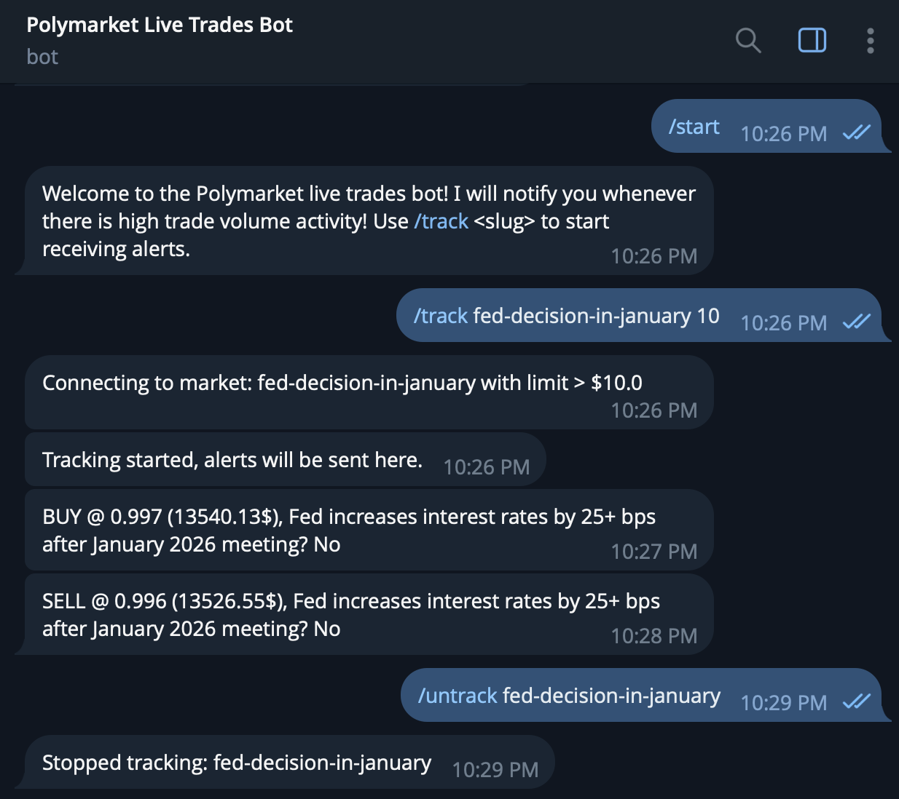
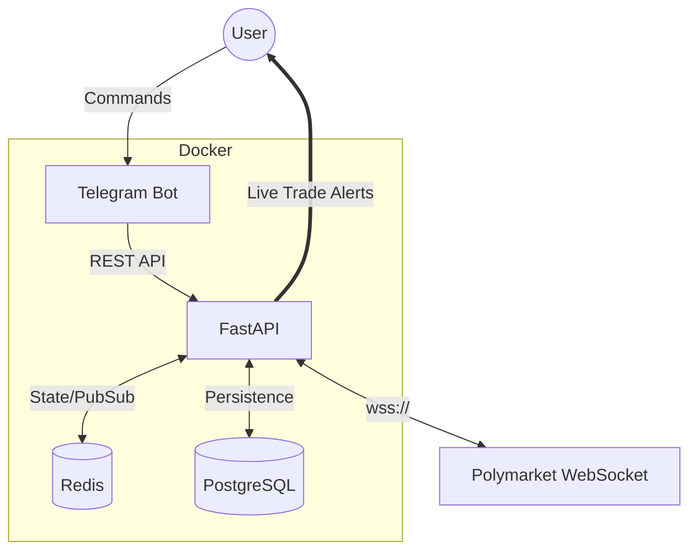

# Polymarket Analytics

A high-performance, real-time trades alert system for [Polymarket](https://polymarket.com). This system ingests live order book data via WebSockets, filters for significant trades ("whale movements"), and delivers sub-second notifications via Telegram.
Try the live bot on Telegram: **[@polymarket_live_trades_bot](https://t.me/polymarket_live_trades_bot)**

## Features

- **Real-Time Alerts:** receive instant Telegram notifications for trades exceeding your specified USD threshold.
- **High-Performance Caching:** uses **Redis** to deduplicate WebSocket streams and manage active subscriptions, reducing latency to microseconds.
- **Robust Persistence:** stores user configurations and historical data in **PostgreSQL**.
- **Microservices Architecture:** fully containerized environment separating the ingestion engine (FastAPI), interface (Telegram Bot), and storage layers.

## Tech Stack

- **Core:** Python 3.11, FastAPI
- **WebSockets:** `websocket-client` for real-time ingestion
- **Database:** PostgreSQL (Persistence), Redis (State & Caching)
- **Interface:** Telegram Bot API
- **Infrastructure:** Docker, Docker Compose (Production deployment on DigitalOcean Droplet)

### Commands
- `/start` : Initialize the bot.
- `/track <slug> [limit]` : Track a market.
  - *Example:* `/track 2024-election-winner 5000` (Alerts for trades over $5k).
- `/untrack <slug>` : Stop receiving alerts for a market.

## Architecture

The system is composed of four main Docker containers:
- **`polymarket_api`**: The brain of the operation. It maintains multiplexed WebSocket connections to Polymarket's CLOB (Central Limit Order Book) and processes trade events.
- **`polymarket_bot`**: The user interface. Handles commands and forwards user intent to the API.
- **`polymarket_redis`**: In-memory data structures for effectively managing thousands of concurrent subscriptions and signal deduplication.
- **`polymarket_db`**: Relational storage for reliable long-term persistence of user preferences.

## Coming Soon: Advanced Analytics

The current infrastructure lays the foundation for a comprehensive data analysis suite. Future updates will leverage **Pandas**, **Matplotlib**, and **SciPy** to provide deep market insights:

- **Historical Volume Trends:** visualizations of trade volume over time to identify market "heat" and liquidity cycles using time-series analysis.
- **Whale Watcher Dashboard:** clustering analysis to detect and visualize coordinated large-scale buying patterns across related markets.
- **Market Correlation Matrices:** statistical analysis of how different event outcomes moves in tandem (e.g. *Election Winner* vs *Fed Rate Cuts*).
- **Volatility & Top Movers:** automated detection of markets with highest standard deviation and 24h price swings.
